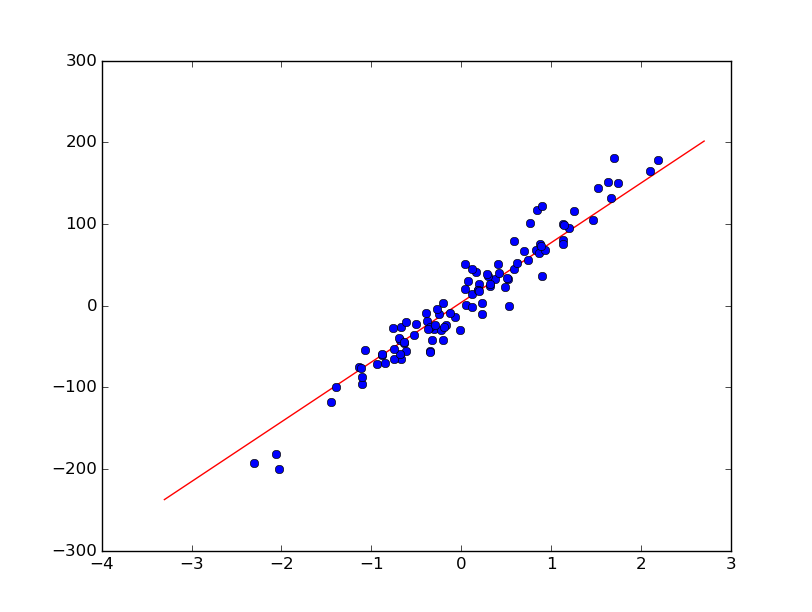
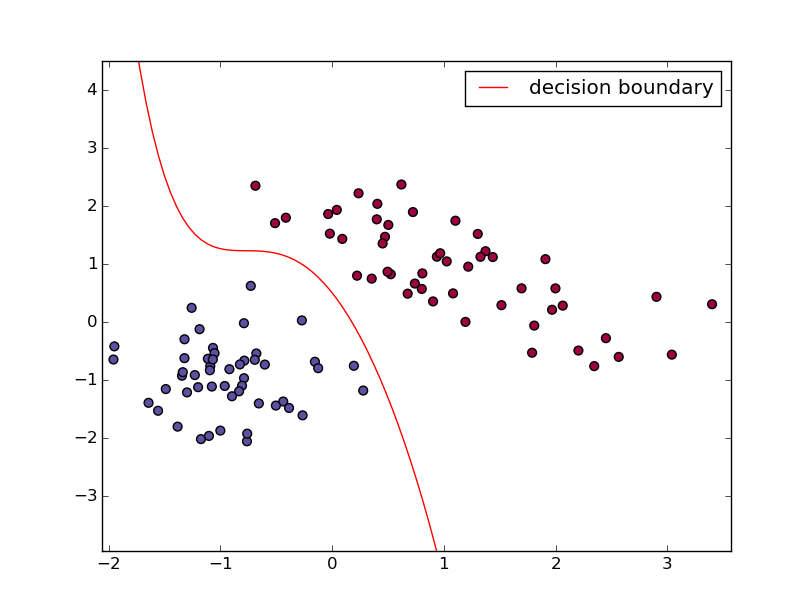

# TinyML

TinyML, as the name suggests, is a tiny machine learning library. Its goal is to offer simple implementations of popular machine learning algorithms meant for use by entry level students and hackers for educational purposes.

## Code Example

### Linear Regression
```py
import numpy as np
from sklearn import datasets

from tinyml import LinearRegression as lr

X,y = datasets.make_regression(n_features=1,n_informative=1, noise=20, random_state=1)
table=np.column_stack((X,y))

p = lr.LinearRegression(table,reg=True,lamda=10)
p.gradient_descent(num_iters=1000,alpha=0.01)
print p.accuracy()
p.plot_fit()

```


### Logistic Regression Classification
```py
from tinyml import LogisticRegression as lo

X,y = datasets.make_classification(n_features=2, n_redundant=0, n_informative=2,n_clusters_per_class=1)
table=np.column_stack((X,y))

p = lo.LogisticRegression(table,reg=True,lamda=5,degree=3)
print p.gradient_descent(num_iters=5000,alpha=0.01)
print p.accuracy()
p.plot_fit()
```


## Motivation

This project was created as an implementation of all the machine learning algorithms that I have been learning. As I started writing down the code for the algorithms, I couldn't find any goto source with well documented and commented python implementation that would help me. So I decided to create one.

## License

The MIT License (MIT)

Copyright (c) 2016 Paras Dahal

Permission is hereby granted, free of charge, to any person obtaining a copy
of this software and associated documentation files (the "Software"), to deal
in the Software without restriction, including without limitation the rights
to use, copy, modify, merge, publish, distribute, sublicense, and/or sell
copies of the Software, and to permit persons to whom the Software is
furnished to do so, subject to the following conditions:

The above copyright notice and this permission notice shall be included in all
copies or substantial portions of the Software.

THE SOFTWARE IS PROVIDED "AS IS", WITHOUT WARRANTY OF ANY KIND, EXPRESS OR
IMPLIED, INCLUDING BUT NOT LIMITED TO THE WARRANTIES OF MERCHANTABILITY,
FITNESS FOR A PARTICULAR PURPOSE AND NONINFRINGEMENT. IN NO EVENT SHALL THE
AUTHORS OR COPYRIGHT HOLDERS BE LIABLE FOR ANY CLAIM, DAMAGES OR OTHER
LIABILITY, WHETHER IN AN ACTION OF CONTRACT, TORT OR OTHERWISE, ARISING FROM,
OUT OF OR IN CONNECTION WITH THE SOFTWARE OR THE USE OR OTHER DEALINGS IN THE
SOFTWARE.
